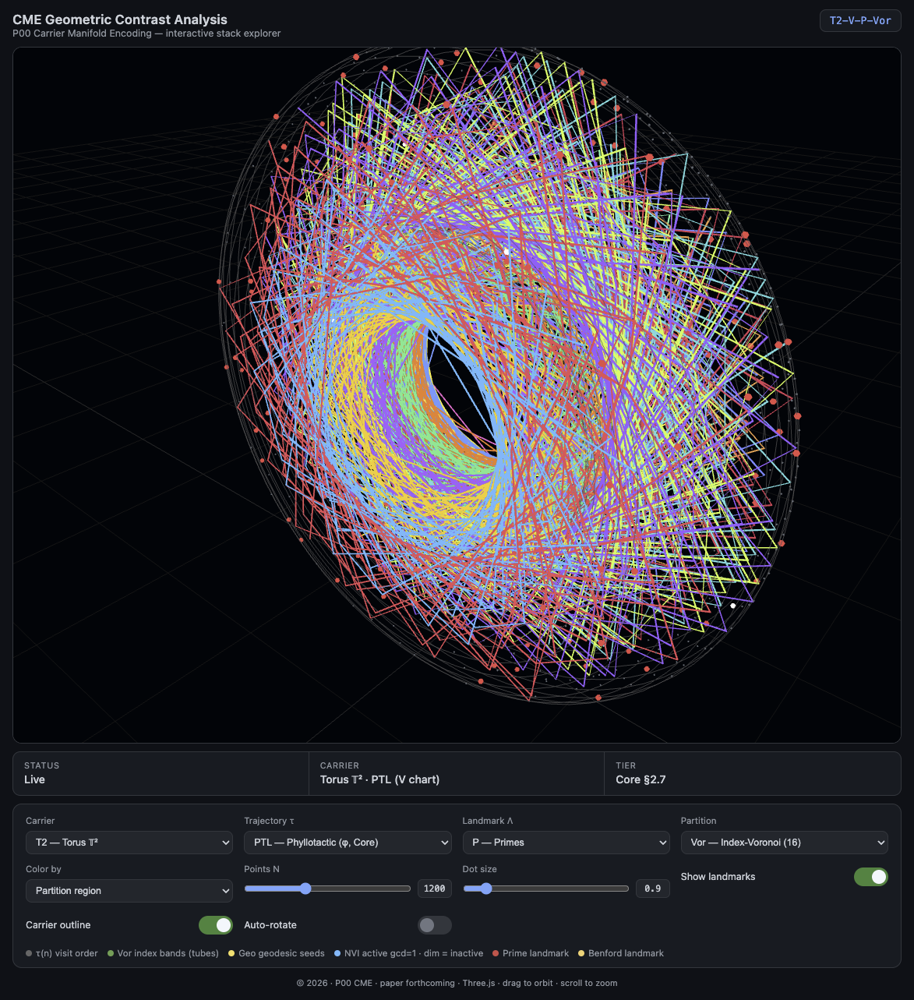

# CME — Interactive Playground

Interactive 3D visualization of **Carrier Manifold Encoding** stack combinations across all carriers. Single-file app (`index.html`), zero build step, runs on **GitHub Pages**.

<!-- embed:start — generated by scripts/update-readme-embed.sh; do not edit manually -->

  

<strong><a href="https://ivlovric.github.io/CME-Playground/">▶ Open interactive demo</a></strong>

<!-- embed:end -->

